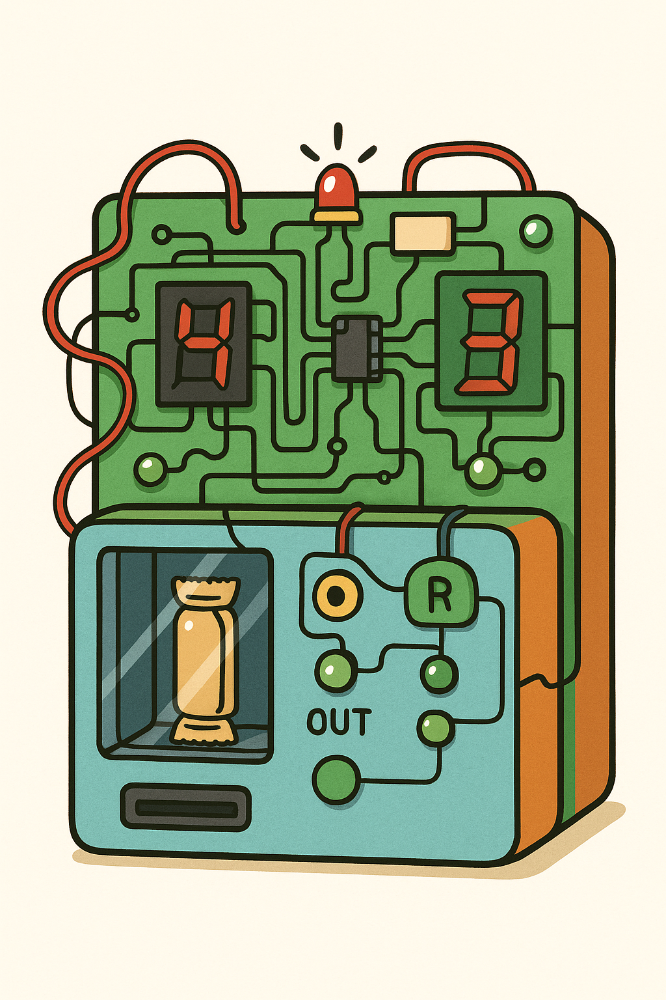
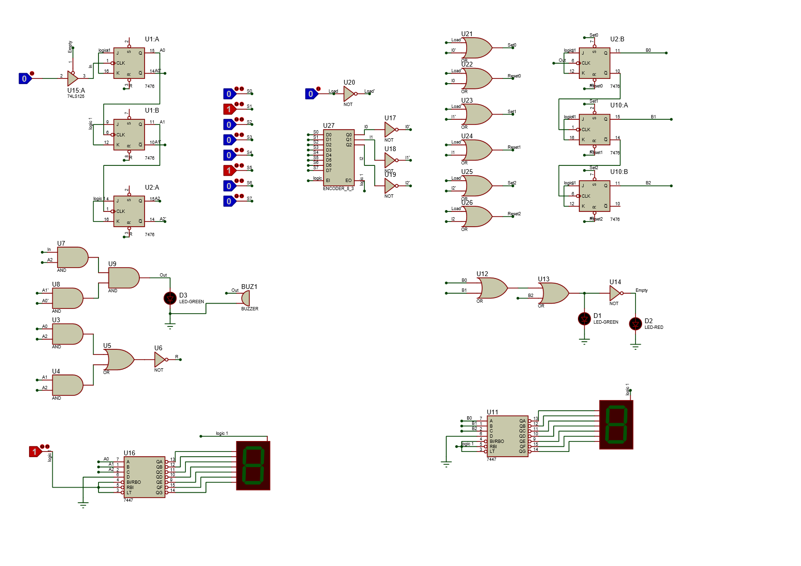

# 🧃 Vending Machine Logic Circuit (Proteus Simulation)

This project is a **digital logic simulation of a vending machine** using **Proteus**.  
It models a basic vending machine that:
- Accepts coins (via momentary button press),
- Dispenses **a single product** priced at **5 units**,
- Allows the machine **owner to refill** products easily.

## 🛠 Features
- **Coin Counter**: Accepts up to 5 coins and tracks the number using JK flip-flops.
- **Product Dispenser**: Dispenses one product when 5 coins are inserted, then resets.
- **Product Stock Memory**: Keeps track of how many products are left.
- **Visual Output**: Uses 7-segment displays to show:
  - Inserted coins,
  - Number of products remaining.
- **LED Indicators**:
  - **Green LED**: Products available.
  - **Red LED**: Machine is empty.
- **Owner Refill System**: Easily refill the machine using a priority encoder and load button.

## 🎥 Demo Video
Watch the full simulation demo here:  
[📽️ Google Drive Video Link](https://drive.google.com/file/d/1nu4CfB5IWETVG8toQIkKah-1oBYVqLq-/view?usp=drive_link)

## 📷 Project Screenshot

